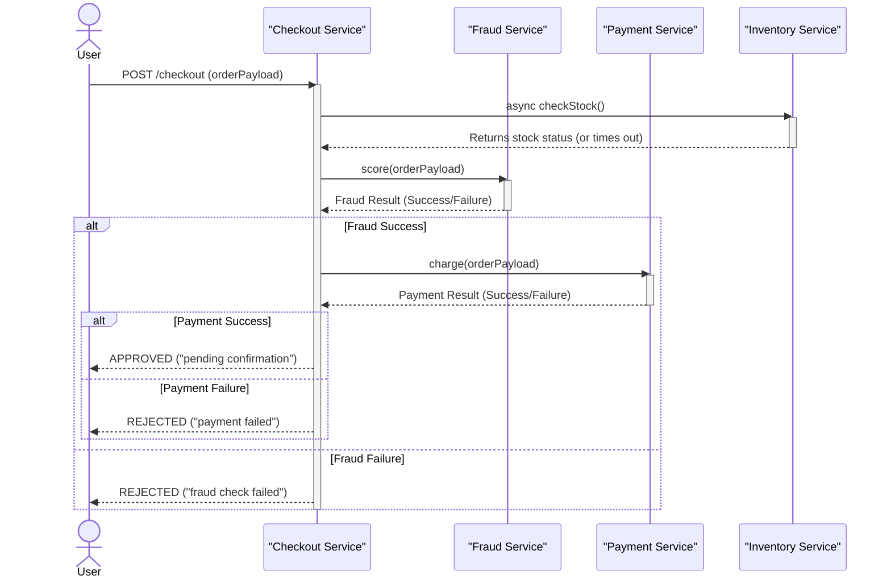
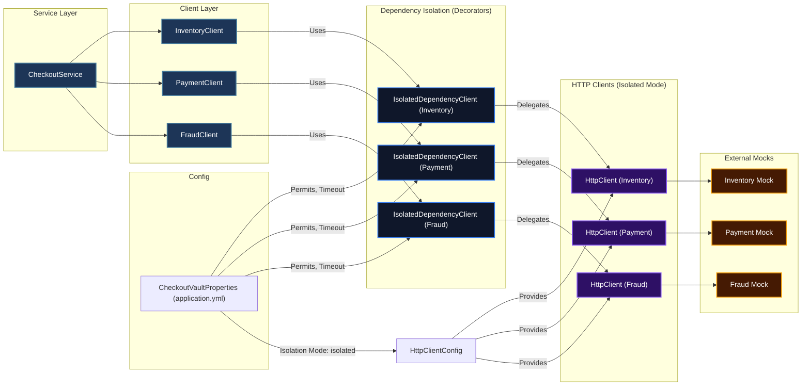
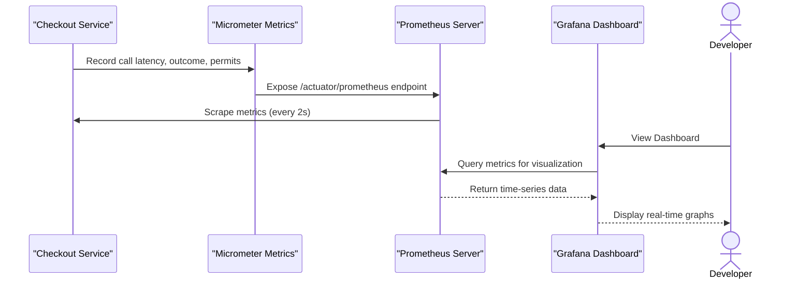
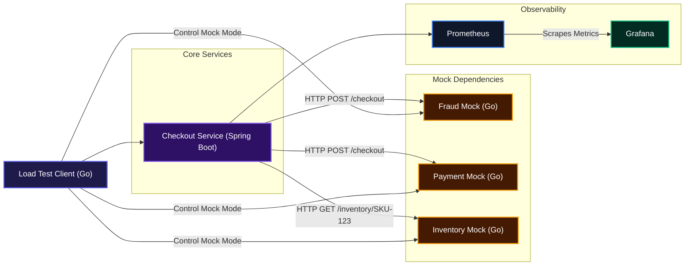

# checkout-vault

This project helps you build a checkout service that stays resilient even when its external dependencies struggle. It solves the common problem of cascading failures in microservices by isolating calls to services like fraud, payment, and inventory. This ensures critical payment and fraud checks remain stable if an unrelated service slows down or hangs.

## Installation

Getting `checkout-vault` up and running on your local machine is straightforward. Follow these steps:

1.  **Clone the Repository**
    Start by cloning the project to your local machine:
    ```bash
    git clone https://github.com/DanielPopoola/checkout-vault.git
    cd checkout-vault
    ```

2.  **Start the Mock Services**
    The project uses Go-based mock services for Fraud, Payment, and Inventory. These will listen on ports `8080`, `8081`, and `8082` respectively.
    ```bash
    make mocks-up
    ```
    To stop them:
    ```bash
    make mocks-down
    ```

3.  **Start the Checkout Service**
    The `checkout-service` is a Spring Boot application. Before starting, you can choose the isolation mode in `checkout-service/src/main/resources/application.yml`. For demonstrating bulkhead isolation, set `checkout-vault.isolation.mode` to `isolated`.
    ```yaml
    checkout-vault:
      isolation:
        mode: isolated # Change to 'naive' to see the isolation bug
    ```
    Then, run the service:
    ```bash
    make checkout-run
    ```
    The service will run on port `8090`.

4.  **Set Up Observability (Prometheus + Grafana)**
    For real-time metrics and visualization of the bulkhead behavior, start Prometheus and Grafana.
    ```bash
    make observability-up
    ```
    You can access them here:
    *   **Prometheus**: `http://localhost:9090` (check "Status -> Targets" to confirm `checkout-service` is `UP`)
    *   **Grafana**: `http://localhost:3000` (the "checkout-vault — Bulkhead Isolation" dashboard is auto-provisioned)

    To stop them:
    ```bash
    make observability-down
    ```

## Usage

Once all services are running, you can use the `loadtest` tool to simulate traffic and verify the isolation mechanisms.

1.  **Run the Load Test / Verifier**
    The `loadtest` utility will send requests to the `checkout-service`, inject a fault into the Inventory mock mid-run, and then compare performance statistics between the baseline and fault-run phases.
    
    To run with default settings (10 requests/second, 15 seconds duration for each phase, Inventory set to `hang` mode):
    ```bash
    make loadtest
    ```
    You can customize the load test parameters:
    ```bash
    make loadtest RATE=50 FAULT_MODE=slow FAULT_DELAY_MS=3000 DURATION=20s
    ```
    *   `RATE`: Requests per second.
    *   `FAULT_MODE`: Mode to inject into Inventory (`hang` or `slow`).
    *   `FAULT_DELAY_MS`: Delay in milliseconds if `FAULT_MODE` is `slow`.
    *   `DURATION`: Duration of each phase (baseline and fault-run).

2.  **Observe Metrics in Grafana**
    While the load test is running, keep an eye on the Grafana dashboard (`http://localhost:3000`). You'll be able to see:
    *   Per-dependency latency (p50 / p99)
    *   Call outcome rates per dependency (success, failure, timeout, bulkhead\_full)
    *   Live semaphore permit availability for each dependency (this is the bulkhead visualized!)

    During fault injection (e.g., Inventory in `hang` mode), you should see Inventory's permit gauge pin at 0 while Fraud's and Payment's gauges remain active, proving their capacity was never touched.

## Features

### Resilient Checkout Workflow

The core `checkout-service` orchestrates calls to various downstream dependencies: Fraud, Payment, and Inventory. Fraud and Payment calls are sequential and critical, meaning a failure in one immediately stops the checkout process. The Inventory check, however, is fired concurrently and does not block the main response, marking the order as "pending confirmation" for inventory status. This design ensures the user gets a fast response while critical path dependencies maintain their isolation.



### Bulkhead Isolation with Dedicated HTTP Clients

This project implements the Bulkhead pattern using a combination of per-dependency semaphores and dedicated `HttpClient` instances. In "isolated" mode, each dependency (Fraud, Payment, Inventory) gets its own `HttpClient` with a small, explicitly sized thread pool and a semaphore to cap in-flight requests. This physical separation prevents a backlog of requests or hung connections in one dependency from consuming resources needed by others.



### Real-time Observability with Prometheus & Grafana

The system is instrumented with Micrometer to expose detailed metrics about dependency calls, latency percentiles (p50, p99), and the real-time state of each dependency's semaphore (permits available). Prometheus scrapes these metrics, which are then visualized in an auto-provisioned Grafana dashboard, providing clear insight into bulkhead behavior and system health.



## System Architecture / Design

The `checkout-vault` project demonstrates microservice resilience through a client-server architecture interacting with mock dependencies and an observability stack. The Go-based load test client simulates user traffic and controls the behavior of the mock services. The core `checkout-service`, built with Spring Boot, handles checkout requests and communicates with Fraud, Payment, and Inventory mock services. Prometheus and Grafana provide real-time monitoring of the system's health and isolation effectiveness.



## Technologies Used

| Technology | Description |
|---|---|
|  | Powers the `checkout-service` with its robust framework. |
|  | Used for the `checkout-service`, leveraging virtual threads for concurrency. |
|  | Implements the lightweight mock services and the load test harness. |
|  | Collects metrics for real-time monitoring and analysis. |
|  | Visualizes metrics through powerful dashboards for observability. |
|  | Provides a vendor-neutral application observability facade for instrumenting services. |

## Further Reading

*   [`TRADEOFFS.md`](https://github.com/DanielPopoola/checkout-vault/blob/main/TRADEOFFS.md) — Dive deeper into the project's design decisions, including the isolation mechanism justification, pool sizing derivation, the bulkhead-vs-circuit-breaker discussion, and insights into what broke first under stress.

## Author Info

*   **LinkedIn**: <https://www.linkedin.com/in/daniel-popoola-942aa8216/>
*   **X (Twitter)**: <https://x.com/iamuchihadan>

## Badges

[](https://spring.io/projects/spring-boot)
[](https://www.java.com/)
[](https://golang.org/)
[](https://prometheus.io/)
[](https://grafana.com/)
[](https://micrometer.io/)

[](https://dokugen.samueltuoyo.com)
